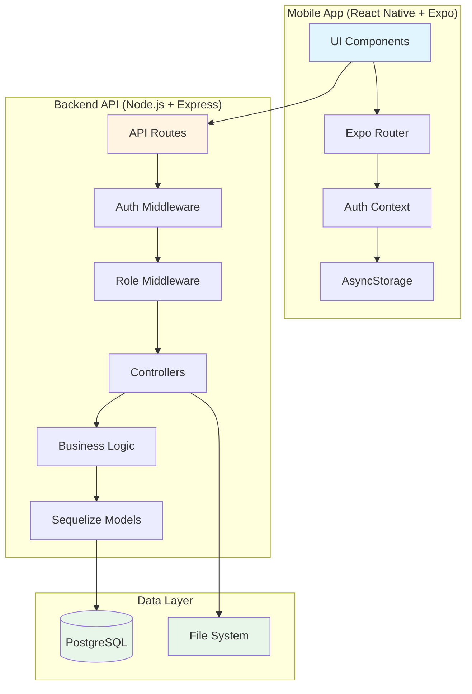
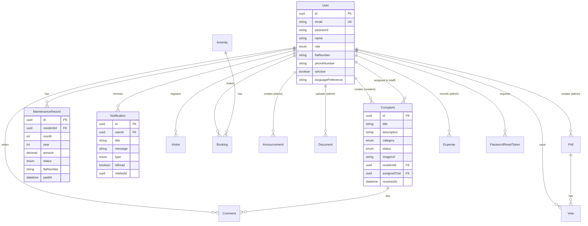

# Design Document: Society Maintenance & Complaint Management System

## Overview

The Society Maintenance & Complaint Management System is a full-stack mobile application built with React Native (Expo) for the frontend and Node.js (Express) for the backend. The system provides role-based access control for three distinct user types: administrators who manage the entire system, residents who can raise complaints and track payments, and maintenance staff who handle assigned tasks.

### Technology Stack

**Frontend:**
- React Native with Expo SDK 51+
- TypeScript for type safety
- NativeWind (Tailwind CSS for React Native) for styling
- Expo Router for file-based navigation
- AsyncStorage for local token storage
- Axios for HTTP requests
- React Hook Form for form validation

**Backend:**
- Node.js with Express.js
- TypeScript for type safety
- PostgreSQL database
- Sequelize ORM for database operations
- JWT (jsonwebtoken) for authentication
- bcrypt for password hashing
- Multer for file uploads
- Express Validator for input validation

**Infrastructure:**
- PostgreSQL 14+ database
- File system storage for uploads (images, documents)
- RESTful API architecture

### Architecture Principles

1. **Separation of Concerns**: Clear separation between presentation (React Native), business logic (Express controllers), and data access (Sequelize models)
2. **Role-Based Access Control**: Middleware-based authorization ensuring users can only access permitted resources
3. **Stateless Authentication**: JWT-based authentication with no server-side session storage
4. **Type Safety**: End-to-end TypeScript for compile-time error detection
5. **Mobile-First Design**: Optimized for mobile devices with responsive layouts


## Architecture

### System Architecture Diagram



### Component Architecture

**Frontend Architecture:**

1. **App Layer** (`app/` directory with Expo Router)
   - File-based routing structure
   - Layout components for role-specific navigation
   - Screen components for each feature

2. **Context Layer**
   - AuthContext: Manages authentication state, token storage, and user session
   - LanguageContext: Manages multi-language support and translations

3. **Service Layer**
   - API client with Axios interceptors for token injection
   - Error handling and response transformation
   - Type-safe API interfaces

4. **Component Layer**
   - Reusable UI components (buttons, cards, forms)
   - Feature-specific components
   - NativeWind styling

**Backend Architecture:**

1. **Route Layer** (`routes/`)
   - Express routers for each resource (users, complaints, maintenance, etc.)
   - Route-level middleware for authentication and authorization
   - Input validation middleware

2. **Middleware Layer**
   - Authentication middleware: JWT validation
   - Authorization middleware: Role-based access control
   - Error handling middleware: Centralized error responses
   - Validation middleware: Request body/query validation

3. **Controller Layer** (`controllers/`)
   - Request handling and response formatting
   - Input validation coordination
   - Service layer orchestration

4. **Service Layer** (`services/`)
   - Business logic implementation
   - Transaction management
   - Cross-model operations

5. **Model Layer** (`models/`)
   - Sequelize model definitions
   - Associations and relationships
   - Validation rules

6. **Database Layer**
   - PostgreSQL with Sequelize ORM
   - Migration files for schema versioning
   - Seed files for initial data


## Components and Interfaces

### Backend API Endpoints

#### Authentication Endpoints

```typescript
POST /api/auth/login
Request: { email: string, password: string }
Response: { token: string, user: { id: string, email: string, role: string, name: string } }

POST /api/auth/logout
Headers: { Authorization: "Bearer <token>" }
Response: { message: string }

POST /api/auth/forgot-password
Request: { email: string }
Response: { message: string }

POST /api/auth/reset-password
Request: { token: string, newPassword: string }
Response: { message: string }
```

#### User Management Endpoints

```typescript
GET /api/users
Headers: { Authorization: "Bearer <token>" }
Query: { role?: string, isActive?: boolean, page?: number, limit?: number }
Response: { users: User[], total: number, page: number }
Permissions: Admin only

POST /api/users
Headers: { Authorization: "Bearer <token>" }
Request: { email: string, password: string, name: string, role: string, flatNumber?: string, phoneNumber?: string }
Response: { user: User }
Permissions: Admin only

GET /api/users/:id
Headers: { Authorization: "Bearer <token>" }
Response: { user: User }
Permissions: Admin or self

PUT /api/users/:id
Headers: { Authorization: "Bearer <token>" }
Request: { name?: string, email?: string, phoneNumber?: string, flatNumber?: string }
Response: { user: User }
Permissions: Admin or self

DELETE /api/users/:id (soft delete)
Headers: { Authorization: "Bearer <token>" }
Response: { message: string }
Permissions: Admin only
```

#### Complaint Endpoints

```typescript
GET /api/complaints
Headers: { Authorization: "Bearer <token>" }
Query: { status?: string, category?: string, page?: number, limit?: number }
Response: { complaints: Complaint[], total: number }
Permissions: Admin sees all, Resident sees own, Staff sees assigned

POST /api/complaints
Headers: { Authorization: "Bearer <token>" }
Request: FormData { title: string, description: string, category: string, image?: File }
Response: { complaint: Complaint }
Permissions: Resident only

GET /api/complaints/:id
Headers: { Authorization: "Bearer <token>" }
Response: { complaint: Complaint, comments: Comment[] }
Permissions: Admin, complaint creator, or assigned staff

PUT /api/complaints/:id/assign
Headers: { Authorization: "Bearer <token>" }
Request: { assignedToId: string }
Response: { complaint: Complaint }
Permissions: Admin only

PUT /api/complaints/:id/status
Headers: { Authorization: "Bearer <token>" }
Request: { status: string }
Response: { complaint: Complaint }
Permissions: Assigned staff or Admin

POST /api/complaints/:id/comments
Headers: { Authorization: "Bearer <token>" }
Request: { text: string }
Response: { comment: Comment }
Permissions: Admin, complaint creator, or assigned staff
```

#### Maintenance Payment Endpoints

```typescript
GET /api/maintenance
Headers: { Authorization: "Bearer <token>" }
Query: { month?: number, year?: number, status?: string, page?: number }
Response: { records: MaintenanceRecord[], total: number }
Permissions: Admin sees all, Resident sees own

POST /api/maintenance/generate
Headers: { Authorization: "Bearer <token>" }
Request: { month: number, year: number, amount: number }
Response: { records: MaintenanceRecord[], count: number }
Permissions: Admin only

PUT /api/maintenance/:id/pay
Headers: { Authorization: "Bearer <token>" }
Request: { paymentMethod?: string, transactionId?: string }
Response: { record: MaintenanceRecord }
Permissions: Admin only

GET /api/maintenance/reports
Headers: { Authorization: "Bearer <token>" }
Query: { startDate?: string, endDate?: string }
Response: { totalCollected: number, totalOutstanding: number, collectionRate: number }
Permissions: Admin only
```

#### Dashboard Endpoints

```typescript
GET /api/dashboard
Headers: { Authorization: "Bearer <token>" }
Response: Role-specific dashboard data
- Admin: { totalComplaints, pendingComplaints, resolvedComplaints, staffWorkload, paymentSummary }
- Resident: { myComplaints, paymentsDue, recentAnnouncements }
- Staff: { assignedComplaints, completedTasks, pendingTasks }
```

#### Notification Endpoints

```typescript
GET /api/notifications
Headers: { Authorization: "Bearer <token>" }
Query: { isRead?: boolean, page?: number }
Response: { notifications: Notification[], total: number }

PUT /api/notifications/:id/read
Headers: { Authorization: "Bearer <token>" }
Response: { notification: Notification }

PUT /api/notifications/read-all
Headers: { Authorization: "Bearer <token>" }
Response: { count: number }
```

#### Announcement Endpoints

```typescript
GET /api/announcements
Headers: { Authorization: "Bearer <token>" }
Query: { page?: number, limit?: number }
Response: { announcements: Announcement[], total: number }

POST /api/announcements
Headers: { Authorization: "Bearer <token>" }
Request: { title: string, content: string, priority: string, isPinned?: boolean }
Response: { announcement: Announcement }
Permissions: Admin only

PUT /api/announcements/:id
Headers: { Authorization: "Bearer <token>" }
Request: { title?: string, content?: string, priority?: string, isPinned?: boolean }
Response: { announcement: Announcement }
Permissions: Admin only

DELETE /api/announcements/:id
Headers: { Authorization: "Bearer <token>" }
Response: { message: string }
Permissions: Admin only
```

#### Document Management Endpoints

```typescript
GET /api/documents
Headers: { Authorization: "Bearer <token>" }
Query: { category?: string, page?: number }
Response: { documents: Document[], total: number }

POST /api/documents
Headers: { Authorization: "Bearer <token>" }
Request: FormData { file: File, category: string, description?: string }
Response: { document: Document }
Permissions: Admin only

GET /api/documents/:id/download
Headers: { Authorization: "Bearer <token>" }
Response: File stream

DELETE /api/documents/:id
Headers: { Authorization: "Bearer <token>" }
Response: { message: string }
Permissions: Admin only
```

#### Visitor Management Endpoints

```typescript
GET /api/visitors
Headers: { Authorization: "Bearer <token>" }
Query: { status?: string, date?: string }
Response: { visitors: Visitor[], total: number }
Permissions: Admin sees all, Resident sees own

POST /api/visitors
Headers: { Authorization: "Bearer <token>" }
Request: { name: string, phoneNumber: string, expectedDate: string, purpose: string }
Response: { visitor: Visitor, visitorCode: string }
Permissions: Resident only

PUT /api/visitors/:id/checkin
Headers: { Authorization: "Bearer <token>" }
Request: { visitorCode: string }
Response: { visitor: Visitor }
Permissions: Admin or Staff

PUT /api/visitors/:id/checkout
Headers: { Authorization: "Bearer <token>" }
Response: { visitor: Visitor }
Permissions: Admin or Staff
```

#### Amenity Booking Endpoints

```typescript
GET /api/amenities
Headers: { Authorization: "Bearer <token>" }
Response: { amenities: Amenity[] }

GET /api/bookings
Headers: { Authorization: "Bearer <token>" }
Query: { amenityId?: string, date?: string, status?: string }
Response: { bookings: Booking[], total: number }

POST /api/bookings
Headers: { Authorization: "Bearer <token>" }
Request: { amenityId: string, date: string, startTime: string, endTime: string }
Response: { booking: Booking }
Permissions: Resident only

PUT /api/bookings/:id/cancel
Headers: { Authorization: "Bearer <token>" }
Response: { booking: Booking }
Permissions: Booking creator or Admin
```

#### Emergency Contact Endpoints

```typescript
GET /api/emergency-contacts
Headers: { Authorization: "Bearer <token>" }
Response: { contacts: EmergencyContact[] }

POST /api/emergency-contacts
Headers: { Authorization: "Bearer <token>" }
Request: { name: string, designation: string, phoneNumber: string, type: string, priority: number }
Response: { contact: EmergencyContact }
Permissions: Admin only

PUT /api/emergency-contacts/:id
Headers: { Authorization: "Bearer <token>" }
Request: { name?: string, phoneNumber?: string, priority?: number }
Response: { contact: EmergencyContact }
Permissions: Admin only
```

#### Poll Endpoints

```typescript
GET /api/polls
Headers: { Authorization: "Bearer <token>" }
Query: { status?: string }
Response: { polls: Poll[], total: number }

POST /api/polls
Headers: { Authorization: "Bearer <token>" }
Request: { question: string, options: string[], startDate: string, endDate: string }
Response: { poll: Poll }
Permissions: Admin only

POST /api/polls/:id/vote
Headers: { Authorization: "Bearer <token>" }
Request: { optionIndex: number }
Response: { vote: Vote }
Permissions: Resident only

GET /api/polls/:id/results
Headers: { Authorization: "Bearer <token>" }
Response: { poll: Poll, results: { option: string, count: number }[] }
```

#### Expense Tracking Endpoints

```typescript
GET /api/expenses
Headers: { Authorization: "Bearer <token>" }
Query: { category?: string, startDate?: string, endDate?: string, page?: number }
Response: { expenses: Expense[], total: number }

POST /api/expenses
Headers: { Authorization: "Bearer <token>" }
Request: FormData { amount: number, category: string, description: string, date: string, vendor?: string, receipt?: File }
Response: { expense: Expense }
Permissions: Admin only

GET /api/expenses/reports
Headers: { Authorization: "Bearer <token>" }
Query: { startDate?: string, endDate?: string }
Response: { totalExpenses: number, categoryBreakdown: object, monthlyTrend: object }
Permissions: Admin or Resident
```


### Frontend Components

#### Screen Components

**Authentication Screens:**
- `app/(auth)/login.tsx`: Login form with email/password
- `app/(auth)/forgot-password.tsx`: Password reset request form
- `app/(auth)/reset-password.tsx`: New password entry form

**Admin Screens:**
- `app/(admin)/dashboard.tsx`: Admin dashboard with metrics
- `app/(admin)/users/index.tsx`: User list with filters
- `app/(admin)/users/new.tsx`: Create new user form
- `app/(admin)/users/[id].tsx`: User detail and edit
- `app/(admin)/complaints/index.tsx`: All complaints list
- `app/(admin)/complaints/[id].tsx`: Complaint detail with assignment
- `app/(admin)/maintenance/index.tsx`: Maintenance records management
- `app/(admin)/maintenance/generate.tsx`: Generate monthly records
- `app/(admin)/announcements/index.tsx`: Announcements list
- `app/(admin)/announcements/new.tsx`: Create announcement
- `app/(admin)/documents/index.tsx`: Document management
- `app/(admin)/expenses/index.tsx`: Expense tracking
- `app/(admin)/reports/index.tsx`: Reports and analytics

**Resident Screens:**
- `app/(resident)/dashboard.tsx`: Resident dashboard
- `app/(resident)/complaints/index.tsx`: My complaints list
- `app/(resident)/complaints/new.tsx`: Create complaint form
- `app/(resident)/complaints/[id].tsx`: Complaint detail with comments
- `app/(resident)/maintenance/index.tsx`: My payment history
- `app/(resident)/visitors/index.tsx`: Visitor management
- `app/(resident)/visitors/new.tsx`: Register visitor
- `app/(resident)/bookings/index.tsx`: My bookings
- `app/(resident)/bookings/new.tsx`: Create booking
- `app/(resident)/announcements/index.tsx`: View announcements
- `app/(resident)/documents/index.tsx`: View documents
- `app/(resident)/polls/index.tsx`: View and vote on polls

**Staff Screens:**
- `app/(staff)/dashboard.tsx`: Staff dashboard
- `app/(staff)/complaints/index.tsx`: Assigned complaints
- `app/(staff)/complaints/[id].tsx`: Complaint detail with status update

**Shared Screens:**
- `app/profile/index.tsx`: View profile
- `app/profile/edit.tsx`: Edit profile
- `app/emergency-contacts/index.tsx`: Emergency contacts list
- `app/notifications/index.tsx`: Notifications list

#### Reusable Components

```typescript
// components/ui/Button.tsx
interface ButtonProps {
  title: string;
  onPress: () => void;
  variant?: 'primary' | 'secondary' | 'danger';
  loading?: boolean;
  disabled?: boolean;
}

// components/ui/Card.tsx
interface CardProps {
  children: React.ReactNode;
  className?: string;
  onPress?: () => void;
}

// components/ui/Input.tsx
interface InputProps {
  label: string;
  value: string;
  onChangeText: (text: string) => void;
  placeholder?: string;
  secureTextEntry?: boolean;
  error?: string;
  multiline?: boolean;
}

// components/ui/Select.tsx
interface SelectProps {
  label: string;
  value: string;
  options: { label: string; value: string }[];
  onChange: (value: string) => void;
  error?: string;
}

// components/complaints/ComplaintCard.tsx
interface ComplaintCardProps {
  complaint: Complaint;
  onPress: () => void;
  showAssignee?: boolean;
}

// components/complaints/StatusBadge.tsx
interface StatusBadgeProps {
  status: 'pending' | 'in_progress' | 'resolved';
}

// components/maintenance/PaymentCard.tsx
interface PaymentCardProps {
  record: MaintenanceRecord;
  onPayPress?: () => void;
}

// components/notifications/NotificationItem.tsx
interface NotificationItemProps {
  notification: Notification;
  onPress: () => void;
  onMarkRead: () => void;
}
```

### Middleware Components

#### Authentication Middleware

```typescript
// backend/middleware/auth.ts
interface AuthRequest extends Request {
  user?: {
    id: string;
    email: string;
    role: 'admin' | 'resident' | 'staff';
  };
}

async function authenticate(req: AuthRequest, res: Response, next: NextFunction) {
  // Extract token from Authorization header
  // Verify JWT token
  // Decode payload and attach user to request
  // Call next() or return 401 error
}
```

#### Authorization Middleware

```typescript
// backend/middleware/authorize.ts
function authorize(...roles: string[]) {
  return (req: AuthRequest, res: Response, next: NextFunction) => {
    // Check if req.user.role is in allowed roles
    // Call next() or return 403 error
  };
}
```

#### Validation Middleware

```typescript
// backend/middleware/validate.ts
function validate(schema: ValidationSchema) {
  return (req: Request, res: Response, next: NextFunction) => {
    // Validate req.body against schema
    // Call next() or return 400 error with validation messages
  };
}
```

#### Error Handling Middleware

```typescript
// backend/middleware/errorHandler.ts
function errorHandler(err: Error, req: Request, res: Response, next: NextFunction) {
  // Log error
  // Determine error type and status code
  // Return formatted error response
}
```


## Data Models

### Database Schema

#### User Model

```typescript
interface User {
  id: string; // UUID, Primary Key
  email: string; // Unique, Not Null
  password: string; // Hashed with bcrypt, Not Null
  name: string; // Not Null
  role: 'admin' | 'resident' | 'staff'; // Not Null
  flatNumber?: string; // For residents
  phoneNumber?: string;
  isActive: boolean; // Default: true
  languagePreference: string; // Default: 'en'
  createdAt: Date;
  updatedAt: Date;
}

// Associations:
// User hasMany Complaint (as resident)
// User hasMany Complaint (as assignedTo)
// User hasMany MaintenanceRecord
// User hasMany Notification
// User hasMany Visitor
// User hasMany Booking
// User hasMany Vote
// User hasMany Comment
```

#### Complaint Model

```typescript
interface Complaint {
  id: string; // UUID, Primary Key
  title: string; // Not Null
  description: string; // Not Null
  category: 'plumbing' | 'electrical' | 'cleaning' | 'security' | 'other'; // Not Null
  status: 'pending' | 'in_progress' | 'resolved'; // Default: 'pending'
  imageUrl?: string; // Path to uploaded image
  residentId: string; // Foreign Key to User, Not Null
  assignedToId?: string; // Foreign Key to User (staff)
  resolvedAt?: Date;
  createdAt: Date;
  updatedAt: Date;
}

// Associations:
// Complaint belongsTo User (as resident)
// Complaint belongsTo User (as assignedTo)
// Complaint hasMany Comment
```

#### MaintenanceRecord Model

```typescript
interface MaintenanceRecord {
  id: string; // UUID, Primary Key
  residentId: string; // Foreign Key to User, Not Null
  month: number; // 1-12, Not Null
  year: number; // Not Null
  amount: number; // Decimal, Not Null
  status: 'due' | 'paid' | 'overdue'; // Default: 'due'
  flatNumber: string; // Not Null
  paidAt?: Date;
  paymentMethod?: string;
  transactionId?: string;
  createdAt: Date;
  updatedAt: Date;
}

// Associations:
// MaintenanceRecord belongsTo User (as resident)

// Indexes:
// Composite index on (residentId, month, year) for uniqueness
```

#### Notification Model

```typescript
interface Notification {
  id: string; // UUID, Primary Key
  userId: string; // Foreign Key to User, Not Null
  title: string; // Not Null
  message: string; // Not Null
  type: 'complaint' | 'payment' | 'announcement' | 'general'; // Not Null
  isRead: boolean; // Default: false
  relatedId?: string; // ID of related entity (complaint, announcement, etc.)
  createdAt: Date;
  updatedAt: Date;
}

// Associations:
// Notification belongsTo User

// Indexes:
// Index on (userId, isRead) for efficient queries
// Index on createdAt for ordering
```

#### Announcement Model

```typescript
interface Announcement {
  id: string; // UUID, Primary Key
  title: string; // Not Null
  content: string; // Not Null
  priority: 'low' | 'medium' | 'high'; // Default: 'medium'
  isPinned: boolean; // Default: false
  isActive: boolean; // Default: true
  createdBy: string; // Foreign Key to User (admin)
  createdAt: Date;
  updatedAt: Date;
}

// Associations:
// Announcement belongsTo User (as createdBy)

// Indexes:
// Index on (isPinned, createdAt) for efficient listing
```

#### Document Model

```typescript
interface Document {
  id: string; // UUID, Primary Key
  filename: string; // Original filename, Not Null
  filePath: string; // Storage path, Not Null
  category: 'rules' | 'minutes' | 'policies' | 'financial' | 'other'; // Not Null
  description?: string;
  fileSize: number; // In bytes
  mimeType: string;
  uploadedBy: string; // Foreign Key to User (admin)
  createdAt: Date;
  updatedAt: Date;
}

// Associations:
// Document belongsTo User (as uploadedBy)
```

#### Visitor Model

```typescript
interface Visitor {
  id: string; // UUID, Primary Key
  residentId: string; // Foreign Key to User, Not Null
  name: string; // Not Null
  phoneNumber: string; // Not Null
  expectedDate: Date; // Not Null
  purpose: string; // Not Null
  visitorCode: string; // Unique code for verification, Not Null
  status: 'expected' | 'checked_in' | 'checked_out' | 'expired'; // Default: 'expected'
  checkInTime?: Date;
  checkOutTime?: Date;
  createdAt: Date;
  updatedAt: Date;
}

// Associations:
// Visitor belongsTo User (as resident)

// Indexes:
// Index on visitorCode for quick lookup
// Index on (residentId, expectedDate) for filtering
```

#### Amenity Model

```typescript
interface Amenity {
  id: string; // UUID, Primary Key
  name: string; // Not Null, e.g., "Clubhouse", "Gym", "Swimming Pool"
  description?: string;
  isActive: boolean; // Default: true
  bookingDuration: number; // Duration in hours
  maxAdvanceBookingDays: number; // Default: 7
  createdAt: Date;
  updatedAt: Date;
}

// Associations:
// Amenity hasMany Booking
```

#### Booking Model

```typescript
interface Booking {
  id: string; // UUID, Primary Key
  amenityId: string; // Foreign Key to Amenity, Not Null
  residentId: string; // Foreign Key to User, Not Null
  date: Date; // Not Null
  startTime: string; // Time in HH:mm format, Not Null
  endTime: string; // Time in HH:mm format, Not Null
  status: 'confirmed' | 'cancelled'; // Default: 'confirmed'
  createdAt: Date;
  updatedAt: Date;
}

// Associations:
// Booking belongsTo Amenity
// Booking belongsTo User (as resident)

// Indexes:
// Composite index on (amenityId, date, startTime) for conflict detection
```

#### EmergencyContact Model

```typescript
interface EmergencyContact {
  id: string; // UUID, Primary Key
  name: string; // Not Null
  designation: string; // Not Null
  phoneNumber: string; // Not Null
  type: 'fire' | 'medical' | 'security' | 'maintenance'; // Not Null
  priority: number; // Display order, Default: 0
  isActive: boolean; // Default: true
  createdAt: Date;
  updatedAt: Date;
}

// Indexes:
// Index on (type, priority) for ordered retrieval
```

#### Poll Model

```typescript
interface Poll {
  id: string; // UUID, Primary Key
  question: string; // Not Null
  options: string[]; // Array of option strings, Not Null
  startDate: Date; // Not Null
  endDate: Date; // Not Null
  status: 'upcoming' | 'active' | 'ended'; // Computed based on dates
  createdBy: string; // Foreign Key to User (admin)
  createdAt: Date;
  updatedAt: Date;
}

// Associations:
// Poll belongsTo User (as createdBy)
// Poll hasMany Vote
```

#### Vote Model

```typescript
interface Vote {
  id: string; // UUID, Primary Key
  pollId: string; // Foreign Key to Poll, Not Null
  userId: string; // Foreign Key to User, Not Null
  optionIndex: number; // Index of selected option, Not Null
  createdAt: Date;
  updatedAt: Date;
}

// Associations:
// Vote belongsTo Poll
// Vote belongsTo User

// Constraints:
// Unique constraint on (pollId, userId) to prevent duplicate voting
```

#### Expense Model

```typescript
interface Expense {
  id: string; // UUID, Primary Key
  amount: number; // Decimal, Not Null
  category: 'maintenance' | 'utilities' | 'security' | 'events' | 'other'; // Not Null
  description: string; // Not Null
  date: Date; // Not Null
  vendor?: string;
  receiptUrl?: string; // Path to uploaded receipt
  recordedBy: string; // Foreign Key to User (admin)
  createdAt: Date;
  updatedAt: Date;
}

// Associations:
// Expense belongsTo User (as recordedBy)

// Indexes:
// Index on (date, category) for reporting queries
```

#### Comment Model

```typescript
interface Comment {
  id: string; // UUID, Primary Key
  complaintId: string; // Foreign Key to Complaint, Not Null
  userId: string; // Foreign Key to User, Not Null
  text: string; // Not Null
  createdAt: Date;
  updatedAt: Date;
}

// Associations:
// Comment belongsTo Complaint
// Comment belongsTo User

// Indexes:
// Index on (complaintId, createdAt) for ordered retrieval
```

#### PasswordResetToken Model

```typescript
interface PasswordResetToken {
  id: string; // UUID, Primary Key
  userId: string; // Foreign Key to User, Not Null
  token: string; // Unique, Not Null
  expiresAt: Date; // Not Null
  used: boolean; // Default: false
  createdAt: Date;
  updatedAt: Date;
}

// Associations:
// PasswordResetToken belongsTo User

// Indexes:
// Index on token for quick lookup
// Index on (userId, used, expiresAt) for validation
```

### Entity Relationship Diagram



